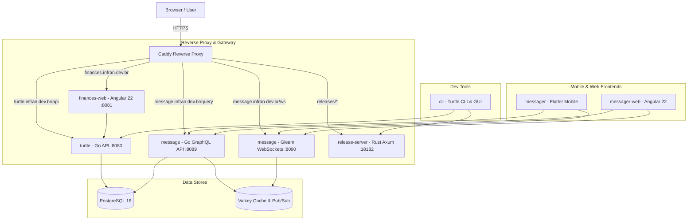

# Turtle Ecosystem Architecture Overview

The Turtle platform uses a decoupled micro-service and micro-frontend architecture behind a reverse proxy (Caddy).

## Core Components
- **`turtle`**: Core Go financial API backend.
- **`finances-web`**: Dedicated Angular 22 financial management web application.
- **`message`**: Dedicated messaging service with GraphQL (Go) and Gleam (Mist/Wisp) WebSockets fanout via Valkey.
- **`messager` & `messager-web`**: Specialized chat clients built in Flutter and Angular 22.
- **`release-server`**: High-performance Rust binary server managing client releases.
- **`cli`**: Go Cobra CLI and Flutter GUI dashboard for ecosystem administration.
- **`turtle-i18n`**: Standalone localization and translation package.
